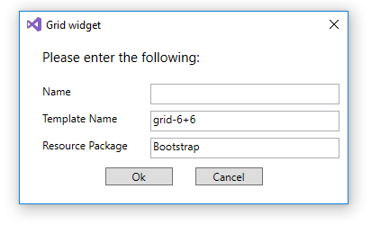

# Sitefinity VSIX
Sitefinity VSIX is a Visual Studio extension that allows developers to create Sitefinity related resources.

## Installation
The extension can be downloaded from the Visual Studio Gallery. Supported VS versions are 2015 and 2017.

## How to use

* Open Sitefinity solution with Visual Studio. 
* Right click on the SitefinityWebApp project. In the Add submenu there is a Sitefinity menu. Inside this menu are listed all available commands.

* Click on a command to execute it.
* A window will pop up asking you to fill the information needed for command execution.

**Note:** During the initial load of the first solution after extension intsallation the extension will download [Sitefinity CLI](https://github.com/Sitefinity/Sitefinity-CLI) from github releases, extract it and create a configuration file.

## Available commands
#### Add new Resource package
Adds a new Resource package with some basic content in it. If the ResourcePackages folder is not existing it will be created.
**Parameters**:
 - Name - name of the resource package to be created
 - TemplateName - name of the template to be used in the creation. Default value is 'Bootstrap'.

#### Add new Page template
Adds a new Page template.
**Parameters**:
 - Name - name of the page template to be created
 - ResourcePackage - name of the resource package where the template will be created. Default value is 'Bootstrap'.
 - TemplateName - name of the template to be used in the creation. Default value is 'Default'.

#### Add new Grid template
Adds a new Grid template.
**Parameters**:
 - Name - name of the grid widget to be created
 - ResourcePackage - name of the resource package where the widget will be created. Default value is 'Bootstrap'.
 - TemplateName - name of the template to be used in the creation. Default value is 'grid-6+6'.

#### Add new Widget
Adds a new Custom widget.
**Parameters**:
 - Name - name of the widget to be created
 - TemplateName - name of the template to be used in the creation. Default value is 'Default'.

## Sitefinity version
The Extension will automatically try to detect the version of the Sitefinity solution and use the correct templates. If the version cannot be detected for any reason the latest templates version will be used.

## Template generation and custom templates
For more information about templates generation and custom templates see the [Sitefinity CLI repository](https://github.com/Sitefinity/Sitefinity-CLI) 
