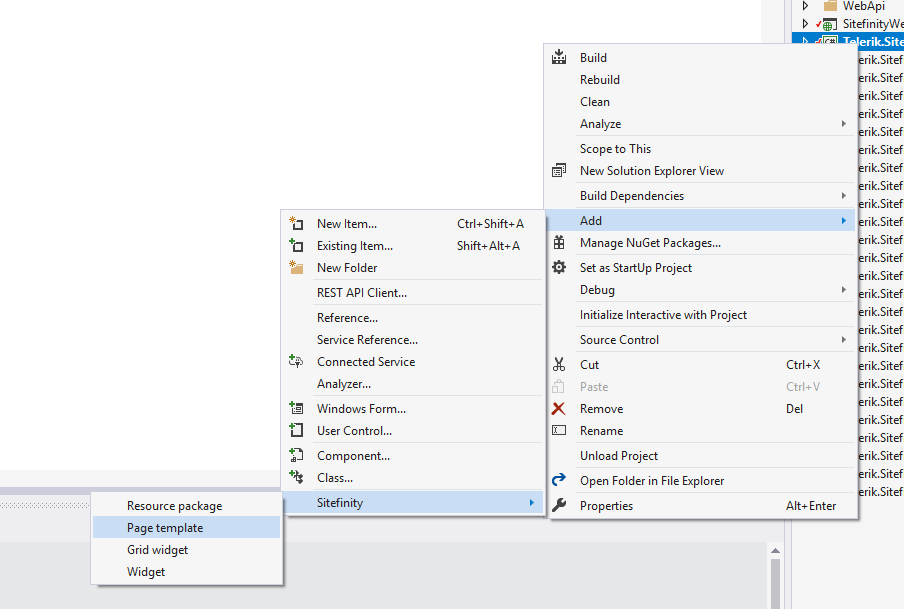

# Sitefinity VSIX
Sitefinity VSIX is a Visual Studio extension that allows you to create Sitefinity CMS related resources. This way you can easily scaffold Sitefinity CMS projects. The tool is focused on facilitating the development of MVC widgets and templates.

## Installation
**PREREQUISITES**: You must be using Microsoft Visual Studio 2015 or 2017.

You can download the extension from Visual Studio Marketplace >> [Sitefinity VSIX](https://marketplace.visualstudio.com/items?itemName=vs-publisher-443.Sitefinity-VSIX).

## Architecture
Sitefinity VSIX is based on Sitefinity CLI. After you install the extension, during the initial load of the first solution, the extension will download Sitefinity CLI from GitHub, extract it, and create a configuration file.

You can also download and use Sitefinity CLI independently, without installing Sitefinity VSIX.
For more information, see [Sitefinity CLI](https://github.com/Sitefinity/Sitefinity-CLI).

## Use Sitefinity VSIX

1. Open your Sitefinity CMS solution in Visual Studio.
2. In the context menu of SitefinityWebApp project, click *Add >> Sitefinity*.

   A submenu with available options expands.
3. Click the resource that you want to create.
4. A dialog appears, where you must fill out the information needed to create the resource. 

## Available commands
#### Resource package
Adds a new Resource package with some basic content in it. If the ResourcePackages folder is not existing it will be created.

Parameters:
 - *Name* - Enter the name of the resource package that you want to create.
 - *TemplateName* - Enter the name of the template you want to use for the creation. The default value is *Bootstrap*.

#### Page template
Adds a new Page template.

Parameters:
 - *Name* - Enter the name of the page template that you want to create.
 - *ResourcePackage* - Enter the name of the resource package where the template will be created. The default value is *Bootstrap*.
 - *TemplateName* - Enter the name of the template that you want to use in the creation. The default value is *Default*.

#### Grid widget

Adds a new Grid widget.

Parameters:
 - *Name* - Enter the name of the grid widget that you want to create.
 - *ResourcePackage* - Enter the name of the resource package where the widget will be created. The default value is *Bootstrap*.
 - *TemplateName* - Enter the name of the template you want to use for the creation. The default value is *grid-6+6*.

#### Widget
Adds a new custom widget.

Parameters:
 - *Name* - Enter the name of the widget that you want to create.
 - *TemplateName* - Enter the name of the template that you want to use in the creation. The default value is *Default*.

## Sitefinity version
Sitefinity VSIX will automatically try to detect the version of your Sitefinity CMS project and use the respective templates. If the version cannot be detected, Sitefinity VSIX uses the latest available version of the templates.

## Template generation and custom templates
For more information about templates generation and custom templates see the [Sitefinity CLI repository](https://github.com/Sitefinity/Sitefinity-CLI) 
